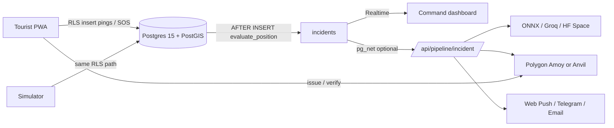

# Smart Tourist Safety Monitoring & Incident Response System

**SIH 2025 · Ministry of Development of North Eastern Region · Cybersecurity PS-04 / Travel & Tourism PS-01**

PostGIS geo-fencing, a soulbound digital ID (keccak256 commitments only), and AI triage — **₹0 infrastructure**, no credit card anywhere in the stack.

---

## 3-command setup

```bash
cp .env.example .env.local && cp .env.example .env
pnpm install
pnpm dev
```

Then `pnpm db:reset` (local Supabase) or point `.env.local` at a free Supabase project. Demo logins after seed: **admin@demo.sts** / **priya.sharma@demo.sts**, password `DemoPass123!`.

Unplugged venue: [`docs/OFFLINE-DEMO.md`](docs/OFFLINE-DEMO.md). Six-minute pitch: [`docs/DEMO-SCRIPT.md`](docs/DEMO-SCRIPT.md). Hostile Q&A: [`docs/JUDGE-QA.md`](docs/JUDGE-QA.md).

---

## Live demo URLs

Replace the host after `vercel --prod` (Hobby, no card):

| Surface | URL |
| --- | --- |
| Tourist PWA | https://sts-safety.vercel.app/home |
| Onboarding / DigiLocker | https://sts-safety.vercel.app/onboard |
| Command centre | https://sts-safety.vercel.app/dashboard |
| Checkpoint verify | https://sts-safety.vercel.app/verify |
| Health / keepalive | https://sts-safety.vercel.app/api/health |
| Source | https://github.com/mitanshj07/sts-safety |

Local: `http://127.0.0.1:3000` with the same paths.

---

## Architecture



The geofence engine is **PL/pgSQL + PostGIS**, not application code. Blockchain and AI are enhancements: an alert still fires if Amoy, Groq, and the HF Space are all down.

Full write-up: [`docs/02-ARCHITECTURE.md`](docs/02-ARCHITECTURE.md).

---

## Measured SOS latency

| Hop | Figure | How we know |
| --- | --- | --- |
| `incidents` INSERT → first notification channel | **180–450 ms** typical on the local stack | `notify.sos_to_telegram_ms` / `first_channel_ms` in the web server log |
| INSERT → Telegram control-room message (online) | **target &lt; 2 000 ms** | Same log field when `NOTIFY_CHANNELS` includes `telegram` |

Quote the Realtime number if the venue WAN is poor; quote Telegram only if the bot is live.

---

## Free-tier proof

| Component | Product | Free forever? | Card? | Offline / local fallback |
| --- | --- | --- | --- | --- |
| App | Next.js 16 on **Vercel Hobby** | Yes | No | `pnpm --filter @sts/web dev` |
| UI | Tailwind v4 + shadcn/ui | Yes | No | in-repo |
| Map | MapLibre GL JS v5 + **OpenFreeMap** | Yes | No | `NEXT_PUBLIC_MAP_TILE_MODE=pmtiles-local` + `/offline/*.geojson` |
| Geo logic | Turf.js (device) + PostGIS (server) | Yes | No | on-device geofence + local Postgres |
| Database | **Supabase Free** Postgres 15 + PostGIS 3 | Yes (500 MB, pauses after 7d inactivity) | No | `DB_MODE=supabase-local` / `supabase start` |
| Auth / Realtime / Storage | Supabase Free | Yes | No | same local stack |
| Chain | **Polygon Amoy** (80002) + public RPCs | Yes (testnet POL) | No | `CHAIN_MODE=anvil-local` |
| Contracts | Solidity 0.8.24, Foundry, OpenZeppelin v5 | Yes | No | Anvil |
| Wallet I/O | viem v2 `fallback()` | Yes | No | Anvil / `CHAIN_MODE=disabled` |
| LLM | Groq + Google Gemini (AI Studio) via Vercel AI SDK v6 | Yes (quota) | No | `AI_MODE=onnx-local` or `rules-only` |
| ML | scikit-learn FastAPI on **HF Spaces CPU Basic** | Yes | No | `services/ai/artifacts/iforest.onnx` |
| Push | Web Push VAPID | Yes | No | in-app Realtime |
| Chat ops | Telegram Bot API | Yes | No | skip channel |
| Email | Resend 3 000/mo | Yes | No | skip channel |
| Monorepo | pnpm workspaces | Yes | No | — |

`pnpm check:freetier` fails the build if `STRIPE|TWILIO|MAPBOX|AWS_|GOOGLE_MAPS` appears in the environment.

---

## Workspace scripts

| Script | What it does |
| --- | --- |
| `pnpm dev` | Next.js app |
| `pnpm demo:reset` | Truncate pings/incidents/dispatches/notifications and restore seed (&lt; 10 s) |
| `pnpm sim` | Tourist movement simulator |
| `pnpm test:e2e` | Playwright: identity, geofence, SOS |
| `pnpm chain:deploy:anvil` | Foundry → local Anvil |
| `pnpm check:freetier` | Guardrail against paid SDKs |

---

## Licence

MIT.
